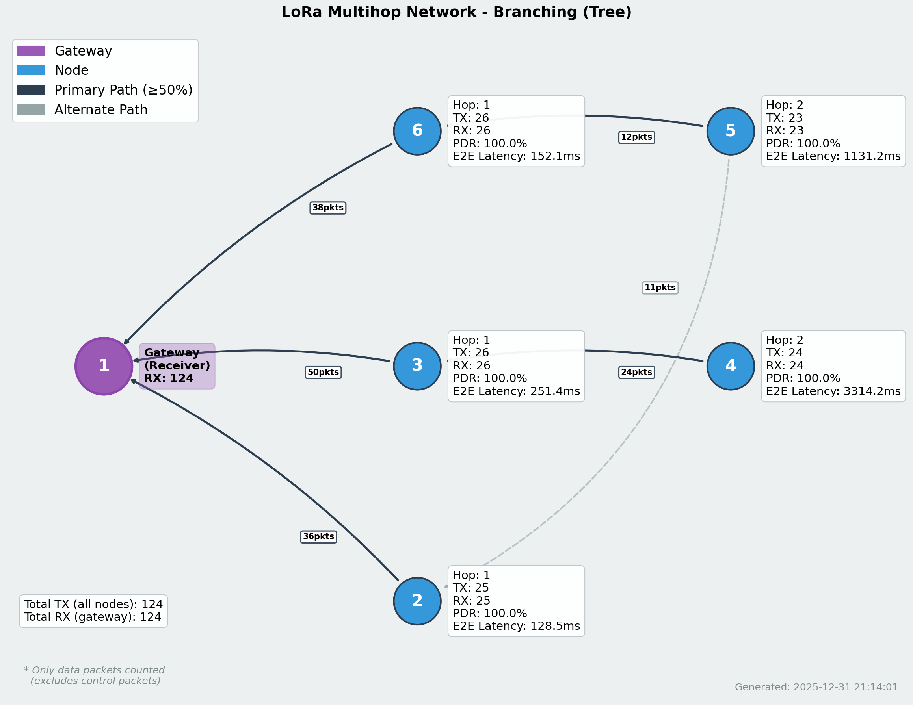
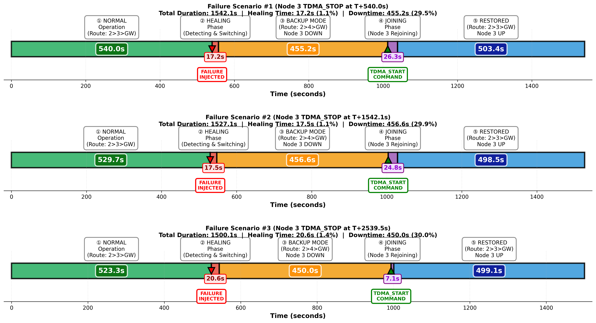

# LoRa Mesh Network dengan TDMA

> **Language / Bahasa:** [🇮🇩 Bahasa Indonesia](README.md) | [🇬🇧 English](README_EN.md)

Implementasi jaringan mesh LoRa multi-hop berbasis Time Division Multiple Access (TDMA) menggunakan modul SX1262 (Ra01S) pada platform ESP32.

## 📋 Daftar Isi

- [Arsitektur Sistem](#arsitektur-sistem)
- [Struktur Paket](#struktur-paket)
- [Mekanisme TDMA](#mekanisme-tdma)
- [Sinkronisasi Waktu](#sinkronisasi-waktu)
- [Hierarki Sinkronisasi (Stratum)](#hierarki-sinkronisasi-stratum)
- [Neighbor Discovery](#neighbor-discovery)
- [Routing & Message Forwarding](#routing--message-forwarding)
- [Flags & Status](#flags--status)
- [Konfigurasi & Setup](#konfigurasi--setup)
- [Monitoring & Debugging](#monitoring--debugging)
- [Hasil Pengujian](#hasil-pengujian)

---

## Arsitektur Sistem

### Komponen Utama

```
┌─────────────────────────────────────────────────────────────┐
│                     LoRa Mesh Node                          │
│                                                             │
│  ┌──────────────┐  ┌──────────────┐  ┌──────────────┐     │
│  │   ESP32      │  │   SX1262     │  │  OLED SSD1306│     │
│  │  Main MCU    │◄─┤  LoRa Radio  ├─►│   Display    │     │
│  └──────────────┘  └──────────────┘  └──────────────┘     │
│                                                             │
│  ┌──────────────┐  ┌──────────────┐  ┌──────────────┐     │
│  │   Rotary     │  │   WiFi (opt) │  │   Sensors    │     │
│  │   Encoder    │  │   NTP Sync   │  │   (AHT10)    │     │
│  └──────────────┘  └──────────────┘  └──────────────┘     │
└─────────────────────────────────────────────────────────────┘
```

### Topologi Jaringan

```
        Gateway (Node 1, Stratum 0)
              │
    ┌─────────┴─────────┐
    │                   │
 Node 2            Node 3
(Stratum 1)      (Stratum 1)
    │                   │
    │              ┌────┴────┐
 Node 4         Node 5    Node 6
(Stratum 2)   (Stratum 2) (Stratum 2)
```

---

## Struktur Paket

### Format Paket Lengkap (48 bytes)

Setiap transmisi menggunakan paket fixed-length 48 bytes dengan struktur sebagai berikut:

```
┌───────────────────────────────────────────────────────────────┐
│                     HEADER SECTION (12 bytes)                 │
├─────┬─────────────────────────────────────────────────────────┤
│ 0-1 │ Destination Address (uint16_t)                          │
│     │ 0x0000 = Broadcast                                      │
├─────┼─────────────────────────────────────────────────────────┤
│  2  │ Command (uint8_t)                                       │
│     │ 0x00 = CMD_ID_AND_POS (neighbor broadcast)              │
│     │ 0x01 = CMD_MESSAGE (reserved)                           │
├─────┼─────────────────────────────────────────────────────────┤
│ 3-4 │ Sender ID (uint16_t)                                    │
├─────┼─────────────────────────────────────────────────────────┤
│  5  │ Sender Slot Index (uint8_t)                             │
├─────┼─────────────────────────────────────────────────────────┤
│  6  │ Sender Hop & Localized (uint8_t)                        │
│     │ bit[7]: isLocalized (1=yes, 0=no)                       │
│     │ bit[6:0]: Hop distance (0-127)                          │
├─────┼─────────────────────────────────────────────────────────┤
│  7  │ Cycle & Neighbor Count (uint8_t)                        │
│     │ bit[7:3]: syncedCycle (0-31)                            │
│     │ bit[2:0]: numNeighbors (0-7)                            │
├─────┼─────────────────────────────────────────────────────────┤
│  8  │ Data Mode (uint8_t)                                     │
│     │ 0x00 = DATA_MODE_NONE (no data)                         │
│     │ 0x01 = DATA_MODE_OWN (own sensor data)                  │
│     │ 0x02 = DATA_MODE_FORWARD (forwarding data)              │
├─────┼─────────────────────────────────────────────────────────┤
│ 9-10│ Hop Decision Target (uint16_t)                          │
│     │ Next hop node ID for routing                            │
├─────┼─────────────────────────────────────────────────────────┤
│ 11  │ Reserved                                                │
└─────┴─────────────────────────────────────────────────────────┘

┌───────────────────────────────────────────────────────────────┐
│                  NEIGHBOR SECTION (16 bytes)                  │
│                   Max 4 neighbors per packet                  │
├─────┬─────────────────────────────────────────────────────────┤
│12-13│ Neighbor 1 ID (uint16_t)                                │
├─────┼─────────────────────────────────────────────────────────┤
│ 14  │ Neighbor 1 Slot (uint8_t)                               │
├─────┼─────────────────────────────────────────────────────────┤
│ 15  │ Neighbor 1 Hop & Localized (uint8_t)                    │
├─────┼─────────────────────────────────────────────────────────┤
│16-19│ Neighbor 2 (same format)                                │
├─────┼─────────────────────────────────────────────────────────┤
│20-23│ Neighbor 3 (same format)                                │
├─────┼─────────────────────────────────────────────────────────┤
│24-27│ Neighbor 4 (same format)                                │
└─────┴─────────────────────────────────────────────────────────┘

┌───────────────────────────────────────────────────────────────┐
│                    DATA SECTION (20 bytes)                    │
│                 (Only if dataMode != NONE)                    │
├─────┬─────────────────────────────────────────────────────────┤
│28-29│ Original Sender ID (uint16_t)                           │
├─────┼─────────────────────────────────────────────────────────┤
│30-31│ Message ID (uint16_t)                                   │
├─────┼─────────────────────────────────────────────────────────┤
│ 32  │ Hop Count (uint8_t)                                     │
├─────┼─────────────────────────────────────────────────────────┤
│ 33  │ Data Length (uint8_t) - max 6 bytes                     │
├─────┼─────────────────────────────────────────────────────────┤
│34-35│ Tracking[0] - Node ID hop 1 (uint16_t)                  │
├─────┼─────────────────────────────────────────────────────────┤
│36-37│ Tracking[1] - Node ID hop 2 (uint16_t)                  │
├─────┼─────────────────────────────────────────────────────────┤
│38-39│ Tracking[2] - Node ID hop 3 (uint16_t)                  │
├─────┼─────────────────────────────────────────────────────────┤
│40-45│ Sensor Data (6 bytes)                                   │
│     │ e.g., "T:25.3" or "B:87%" (ASCII string)                │
├─────┼─────────────────────────────────────────────────────────┤
│46-47│ Reserved                                                │
└─────┴─────────────────────────────────────────────────────────┘
```

### Kegunaan Setiap Section

**1. Header Section:**
- Berisi identitas pengirim dan metadata paket
- Sync cycle untuk sinkronisasi network-wide
- Data mode menentukan apakah paket membawa payload

**2. Neighbor Section:**
- Informasi tetangga langsung (1-hop) dari pengirim
- Digunakan untuk neighbor discovery dan topology mapping
- Memungkinkan indirect neighbor detection (2-hop)

**3. Data Section:**
- Payload sensor data atau forwarded message
- Tracking array untuk latency calculation (timestamp per hop)
- Hop decision target untuk multi-hop routing

---

## Mekanisme TDMA

### Time Slot Allocation

```
┌─────────────────────────────────────────────────────────────┐
│                  TDMA Period (Tperiod)                      │
│              = Nslot × Tslot (e.g., 8 × 500ms = 4s)         │
├─────────┬─────────┬─────────┬─────────┬─────────┬──────────┤
│ Slot 0  │ Slot 1  │ Slot 2  │ Slot 3  │ Slot 4  │  ...     │
│(500ms)  │(500ms)  │(500ms)  │(500ms)  │(500ms)  │          │
└─────────┴─────────┴─────────┴─────────┴─────────┴──────────┘
     ↓
┌─────────────────────────────────────────────────────────────┐
│                   Single Slot Structure                      │
│                      (Tslot = 500ms)                         │
├──────────────┬───────────────────┬──────────────────────────┤
│  RX Phase    │    TX Phase       │    RX Phase              │
│  (Listen)    │  (Transmit)       │    (Listen)              │
│              │                   │                          │
│  ◄────────►  │  ◄─────►          │  ◄──────────────►        │
│   ~240ms     │   ~125ms          │     ~135ms               │
└──────────────┴───────────────────┴──────────────────────────┘
```

### Timing Parameters (Microseconds)

```c
// Slot timing (settings.h)
const uint32_t Tslot_us = 500000UL;         // 500ms per slot
const uint32_t Tprocessing_us = 500000UL;   // 500ms processing phase
const uint32_t Tpacket_us = 125340UL;       // Effective packet ToA
const uint32_t TtxDelay_us = 5000UL;        // 5ms pre-TX delay
const uint32_t TrxDelay_us = 2000UL;        // 2ms pre-RX delay

// CRITICAL FORMULA (DO NOT MODIFY)
const uint32_t slotOffset_us = Tslot_us - Tpacket_us - TtxDelay_us - TrxDelay_us;
// = 500000 - 125340 - 5000 - 2000 = 367660 μs (~368ms)
```

### Collision Avoidance

**1. Automatic Slot Assignment**

Node mendeteksi slot yang terisi dengan memonitor transmisi tetangga:

```c
// Cek slot availability
bool slotAvailability[Nslot];  // true = available, false = occupied

// Saat menerima paket dari tetangga
slotAvailability[senderSlot] = false;  // Tandai slot terpakai
```

**2. Slot Selection Strategy**

```c
void selectSlot() {
  // Strategi: Pilih slot terendah yang available
  for (uint8_t slot = 0; slot < Nslot; slot++) {
    if (slotAvailability[slot]) {
      myInfo.slotIndex = slot;
      break;
    }
  }
}
```

**3. Collision Detection & Recovery**

Jika terjadi collision (dua node pilih slot sama):
- Node mendeteksi via missing ACK atau corrupt packet
- Re-scan slot availability
- Pilih slot alternatif
- Update neighbor list

---

## Sinkronisasi Waktu

### 1. Sinkronisasi Lokal (TDMA Cycle Alignment)

**Rumus Timing Adjustment:**

```c
// Responder function - adjust timing based on received packet
if (senderSlot < myInfo.slotIndex) {
  // Sender adalah sebelum saya dalam cycle
  // slotDiff = jumlah slot antara sender dan receiver
  int32_t slotDiff = myInfo.slotIndex - senderSlot;
  
  // expectedTime = waktu yang seharusnya jika sinkron sempurna
  uint32_t expectedTime = slotDiff * Tslot_us;
  
  // actualTime = waktu aktual sejak cycle start
  uint32_t actualTime = micros() - cycleStartTime;
  
  // Drift = selisih antara expected dan actual
  int32_t drift_us = actualTime - expectedTime;
  
  // Adjustment (gunakan modulo untuk wrap-around)
  if (abs(drift_us) > TIMER_ERROR_MARGIN_US) {
    cycleStartTime += drift_us;  // Koreksi timing
  }
}
```

**Contoh Perhitungan:**

```
Network: 8 slot × 500ms = 4000ms period
Node A: Slot 1
Node B: Slot 4

Node B menerima paket dari Node A:
- slotDiff = 4 - 1 = 3 slot
- expectedTime = 3 × 500000 = 1500000 μs (1.5s)
- actualTime (measured) = 1502000 μs (1.502s)
- drift = 1502000 - 1500000 = +2000 μs (2ms late)

Action: Adjust cycleStartTime -= 2000 μs (advance timing)
```

### 2. Sync Cycle (Network-wide Synchronization)

**Sync Cycle Counter:**

```c
// Setiap node maintains cycle counter (0-31, 5 bits)
uint8_t syncedCycle = 0;

// Increment setiap TDMA period
void incrementCycle() {
  syncedCycle = (syncedCycle + 1) % 32;  // Wrap at 32
}
```

**Propagasi Sync Cycle:**

1. **Gateway (Reference Node)** adalah cycle master
2. Node lain sync ke gateway melalui **hierarchical propagation**
3. Cycle counter dikirim di setiap paket (byte 7, bit 7:3)

**Deteksi Sinkronisasi:**

```c
// Neighbor cycle tracking
uint8_t cycleHistory[3] = {255, 255, 255};  // Last 3 cycles
bool cyclesSequential = false;

// Cek apakah cycle berurutan (network synchronized)
void checkCycleSync(uint8_t newCycle) {
  cycleHistory[cycleHistoryIdx] = newCycle;
  cycleHistoryIdx = (cycleHistoryIdx + 1) % 3;
  
  // Cek sequential: [N, N+1, N+2] atau [30, 31, 0] (wrap)
  if ((cycleHistory[1] == (cycleHistory[0] + 1) % 32) &&
      (cycleHistory[2] == (cycleHistory[1] + 1) % 32)) {
    cyclesSequential = true;  // Network synchronized!
  }
}
```

---

## Hierarki Sinkronisasi (Stratum)

### Konsep Stratum Levels

Sistem menggunakan hierarchical sync model (mirip NTP) untuk propagasi waktu:

```
Stratum 0: Gateway (Authoritative Time Source)
    ↓
Stratum 1: Direct neighbors of gateway
    ↓
Stratum 2: 2-hop dari gateway (neighbors of Stratum 1)
    ↓
Stratum 3: Unsynchronized (local time only)
```

### Stratum Definitions

```c
#define STRATUM_GATEWAY       0    // Gateway node (IS_REFERENCE=1)
#define STRATUM_DIRECT        1    // Synced directly from gateway
#define STRATUM_INDIRECT      2    // Synced from Stratum 1 node
#define STRATUM_LOCAL         3    // Not synced (isolated)

#define SYNC_VALID_CYCLES     5    // Timeout sebelum degradasi
#define STRATUM_INHERIT_DELTA 1    // Inherit stratum + 1
```

### Stratum Propagation Logic

```c
// Saat menerima paket dari neighbor
void updateStratum(uint8_t neighborStratum, uint16_t neighborId) {
  uint8_t proposedStratum = neighborStratum + STRATUM_INHERIT_DELTA;
  
  // Accept jika stratum lebih baik (lebih rendah)
  if (proposedStratum < myInfo.syncStratum) {
    myInfo.syncStratum = proposedStratum;
    myInfo.syncSource = neighborId;
    myInfo.syncValidCounter = SYNC_VALID_CYCLES;
    myInfo.syncedWithGateway = true;
    
    Serial.printf("[Node %d] Stratum upgraded: %d → %d (source: Node %d)\n",
                  myInfo.id, oldStratum, myInfo.syncStratum, neighborId);
  }
  
  // Refresh counter jika dari sumber yang sama
  else if (neighborId == myInfo.syncSource && 
           proposedStratum == myInfo.syncStratum) {
    myInfo.syncValidCounter = SYNC_VALID_CYCLES;
  }
}
```

### Stratum Degradation

```c
// Setiap TDMA cycle, decrement sync counter
void checkSyncTimeout() {
  if (myInfo.syncValidCounter > 0) {
    myInfo.syncValidCounter--;
  }
  
  // Timeout: Degrade stratum
  if (myInfo.syncValidCounter == 0 && myInfo.syncStratum < STRATUM_LOCAL) {
    myInfo.syncStratum++;
    Serial.printf("[Node %d] Stratum degraded: %d (sync timeout)\n",
                  myInfo.id, myInfo.syncStratum);
    
    if (myInfo.syncStratum >= STRATUM_LOCAL) {
      myInfo.syncedWithGateway = false;
    }
  }
}
```

**Mengapa Stratum Penting?**

1. **Reliability**: Node tahu seberapa dekat mereka dengan time authority
2. **Routing Quality**: Prefer routes melalui low-stratum nodes
3. **Latency Accuracy**: Stratum 0-1 memiliki NTP sync (microsecond precision)
4. **Fault Tolerance**: Otomatis downgrade saat kehilangan koneksi

---

## Neighbor Discovery

### One-Directional vs Bidirectional Links

**One-Directional (Unidirectional):**
- Node A mendengar Node B, tetapi Node B tidak mendengar Node A
- RSSI asimetris (obstacles, antenna orientation, power difference)
- **Tidak reliable untuk routing**

**Bidirectional (Two-way):**
- Kedua node saling mendengar
- Confirmed via `amIListedAsNeighbour` flag
- **Digunakan untuk routing decisions**

### Bidirectional Detection Mechanism

```c
// Saat menerima paket, parse neighbor list
for (uint8_t i = 0; i < numNeighborsInPacket; i++) {
  uint16_t neighborId = parseNeighborId(rxBuffer, i);
  
  // Apakah saya ada di neighbor list pengirim?
  if (neighborId == myInfo.id) {
    neighbours[senderIdx].amIListedAsNeighbour = true;
    neighbours[senderIdx].isBidirectional = true;
    
    Serial.printf("[Node %d] Bidirectional link confirmed with Node %d\n",
                  myInfo.id, senderId);
  }
}
```

### Neighbor Table Structure

```c
struct NeighbourInfo {
  uint16_t id;                    // Neighbor ID
  uint8_t slotIndex;              // TDMA slot
  uint8_t hoppingDistance;        // Hop count ke gateway
  bool isLocalized;               // Apakah sudah localized
  uint8_t syncedCycle;            // Last cycle number
  
  // Bidirectional detection
  bool amIListedAsNeighbour;      // Apakah saya di neighbor list mereka?
  bool isBidirectional;           // Link quality confirmed
  
  // Signal quality
  int16_t rssi;                   // Received Signal Strength
  int8_t snr;                     // Signal-to-Noise Ratio
  
  // Indirect neighbors (2-hop)
  uint8_t numberOfNeighbours;     // Berapa tetangga mereka?
  uint16_t neighboursId[MAX_NEIGHBOURS];  // IDs tetangga mereka
  uint8_t neighboursSlot[MAX_NEIGHBOURS];
  uint8_t neighboursHoppingDistance[MAX_NEIGHBOURS];
  
  // Stratum tracking
  uint8_t syncStratum;            // Neighbor's stratum level
  
  // Activity tracking
  uint8_t activityCounter;        // Cycles since last heard
};
```

### Kegunaan Indirect Neighbor Info

**1. Topology Mapping:**
- Visualisasi network structure
- Deteksi bottleneck
- Redundant path discovery

**2. Routing Optimization:**
```c
// Pilih next hop yang dekat dengan destination
uint16_t selectBestNextHop() {
  for (each bidirectional neighbor) {
    // Cek apakah neighbor punya direct link ke destination
    for (each indirect neighbor of this neighbor) {
      if (indirect_neighbor_id == destination) {
        return neighbor_id;  // 2-hop route found!
      }
    }
  }
}
```

**3. Loop Prevention:**
- Node tidak forward ke node yang sudah ada di tracking path

---

## Routing & Message Forwarding

### Hop Count Calculation

**Formula:**

```c
void updateHopCount(uint8_t neighborHop) {
  // Gateway always hop = 0
  if (IS_REFERENCE == 1) {
    myInfo.hoppingDistance = 0;
    return;
  }
  
  // Regular node: hop = min(neighbor's hop) + 1
  uint8_t minHop = 0x7F;  // Max value (uninitialized)
  
  for (each neighbor) {
    if (neighbor.hoppingDistance < minHop) {
      minHop = neighbor.hoppingDistance;
    }
  }
  
  if (minHop != 0x7F) {
    myInfo.hoppingDistance = minHop + 1;
  }
}
```

**Contoh:**

```
Gateway (hop=0) → Node 2 (hop=1) → Node 4 (hop=2) → Node 7 (hop=3)

Node 7 calculation:
- Neighbors: {Node 4 (hop=2), Node 5 (hop=2)}
- minHop = min(2, 2) = 2
- myInfo.hoppingDistance = 2 + 1 = 3 ✓
```

### Message Forwarding Cases

#### Case 1: Generate Own Message

**Kondisi:**
- Node memiliki sensor data
- Forward queue kosong
- Node bukan isolated (hop != 0x7F)

```c
if (hasSensorDataToSend && forwardQueueCount == 0 && 
    myInfo.hoppingDistance != 0x7F) {
  
  dataMode = DATA_MODE_OWN;
  origSender = myInfo.id;
  msgId = ++messageIdCounter;
  hopCount = 1;
  tracking[0] = myInfo.id;
  
  // Select next hop menuju gateway
  hopDecisionTarget = selectBestNextHop();
}
```

**Alasan:** Node sensor perlu mengirim data ke gateway untuk monitoring

#### Case 2: Forward Message (Relay)

**Kondisi:**
- Ada message di forward queue
- Node bukan leaf (hop != 0x7F)

```c
if (forwardQueueCount > 0 && myInfo.hoppingDistance != 0x7F) {
  ForwardMessage msg;
  dequeueForward(&msg);
  
  dataMode = DATA_MODE_FORWARD;
  origSender = msg.originalSender;
  msgId = msg.messageId;
  hopCount = msg.hopCount + 1;  // Increment hop
  
  // Update tracking (log routing path)
  tracking[0] = msg.tracking[0];
  tracking[1] = msg.tracking[1];
  tracking[2] = myInfo.id;  // Add self to path
  
  hopDecisionTarget = selectBestNextHop();
}
```

**Alasan:** Multi-hop routing - relay message menuju gateway

#### Case 3: Receive & Queue for Forward

**Kondisi:**
- Menerima message dengan dataMode != NONE
- Target bukan diri sendiri
- Belum pernah forward message ini (cek msgId)

```c
// Saat menerima paket
if (dataMode != DATA_MODE_NONE) {
  uint16_t origSender = parseOriginalSender(rxBuffer);
  uint16_t msgId = parseMessageId(rxBuffer);
  
  // Apakah untuk saya?
  if (hopDecisionTarget == myInfo.id || hopDecisionTarget == 0) {
    // YES: Process/forward message
    
    // Cek duplicate
    if (msgId == lastProcessedMsgId && origSender == lastProcessedOrigSender) {
      Serial.println("Duplicate message, drop");
      return;
    }
    
    // Apakah saya gateway?
    if (IS_REFERENCE == 1) {
      // Gateway: Log data, send ke server
      Serial.printf("DATA RECEIVED: orig=%d msg=%d hops=%d data=%s\n",
                    origSender, msgId, hopCount, sensorData);
    } else {
      // Non-gateway: Enqueue untuk forward
      enqueueForward(&msg);
    }
  }
}
```

**Alasan:** Distributed routing - setiap node relay message sampai ke gateway

#### Case 4: Drop Message

**Kondisi drop:**

1. **Duplicate Detection:**
```c
if (msgId == lastProcessedMsgId && origSender == lastProcessedOrigSender) {
  return;  // Already processed
}
```

2. **Loop Prevention:**
```c
// Cek apakah saya sudah ada di tracking path
for (uint8_t i = 0; i < hopCount; i++) {
  if (tracking[i] == myInfo.id) {
    Serial.println("Loop detected, drop");
    return;
  }
}
```

3. **Queue Full:**
```c
if (forwardQueueCount >= FORWARD_QUEUE_SIZE) {
  Serial.println("Forward queue full, drop");
  return;
}
```

4. **Isolated Node:**
```c
if (myInfo.hoppingDistance == 0x7F) {
  Serial.println("Isolated node, cannot forward");
  return;
}
```

---

## Flags & Status

### Data Mode Flags

```c
#define DATA_MODE_NONE    0x00  // No payload (neighbor broadcast only)
#define DATA_MODE_OWN     0x01  // Own sensor data
#define DATA_MODE_FORWARD 0x02  // Forwarding data from another node

// Byte 8 di packet
txBuffer[8] = dataMode;
```

**Penggunaan:**
- `NONE`: Heartbeat/neighbor discovery packet
- `OWN`: Node generate data sendiri (sensor reading)
- `FORWARD`: Relay message dari node lain

### Node Status Strings

```c
char nodeStatus[16];  // Status display di OLED

// Status values:
"INIT"       // Initializing
"SYNC"       // Syncing TDMA timing
"IDLE"       // Waiting for TX slot
"TX_ID"      // Transmitting neighbor info only
"TX_DATA"    // Transmitting own data
"TX_FWD"     // Transmitting forwarded message
"RX_PKT"     // Received packet
"RX_TIMEOUT" // No packet received
"ISOLATED"   // No neighbors (hop = 0x7F)
"GATEWAY"    // Reference node (hop = 0)
```

### Localized Flag

```c
// Byte 6 bit[7]
bool isLocalized = (rxBuffer[6] >> 7) & 0x01;

txBuffer[6] = (myInfo.isLocalized << 7) | myInfo.hoppingDistance;
```

**Kegunaan:**
- `true`: Node sudah di-localize (posisi X,Y,Z diketahui)
- `false`: Node belum ter-localize
- Untuk aplikasi positioning/ranging

### Bidirectional Flag

```c
struct NeighbourInfo {
  bool amIListedAsNeighbour;  // Apakah saya di list mereka?
  bool isBidirectional;       // Confirmed two-way link
};
```

**Update Logic:**
```c
// Default: false (one-directional)
neighbour.amIListedAsNeighbour = false;

// Check saat parse neighbor list dari packet
for (uint8_t i = 0; i < numNeighbors; i++) {
  if (neighborsId[i] == myInfo.id) {
    neighbour.amIListedAsNeighbour = true;
    neighbour.isBidirectional = true;
  }
}
```

**Routing Decision:**
```c
// Hanya gunakan bidirectional links untuk routing
uint16_t selectBestNextHop() {
  for (each neighbor) {
    if (!neighbor.isBidirectional) continue;  // Skip unidirectional
    
    // Prefer:
    // 1. Lower hop count (closer to gateway)
    // 2. Better RSSI (signal quality)
    // 3. Lower stratum (time sync quality)
  }
}
```

---

## Konfigurasi & Setup

### 1. Copy Template Configuration

```bash
cd firmware/
cp settings_template.h settings.h
```

### 2. Edit `settings.h`

```c
// ============= NODE CONFIGURATION =============
#define DEVICE_ID 2              // ⚠️ UNIQUE untuk setiap node (1-255)
#define IS_REFERENCE 0           // 1 = Gateway, 0 = Regular node
#define FIX_SLOT 1               // 1 = Fixed slot, 0 = Auto-assign
#define SLOT_DEVICE 2            // Slot number (harus unik jika FIX_SLOT=1)

// ============= WIFI & SERVER =============
#define ENABLE_WIFI 1
#define WIFI_SSID "YourWiFiName"
#define WIFI_PASS "YourPassword"
#define SERVER_IP "192.168.1.100"  // IP server monitoring
#define SERVER_PORT 5000

// ============= DEBUG MODE =============
#define DEBUG_MODE DEBUG_MODE_WIFI_MONITOR  // 0=OFF, 1=GATEWAY, 2=WIFI
```

### 3. Hardware Connections

**ESP32 ↔ SX1262 (Ra01S):**

| ESP32 Pin | SX1262 Pin | Function    |
|-----------|------------|-------------|
| 5         | NSS        | SPI CS      |
| 18        | SCK        | SPI Clock   |
| 19        | MISO       | SPI MISO    |
| 23        | MOSI       | SPI MOSI    |
| 4         | RESET      | Reset       |
| 21        | DIO1       | IRQ         |
| 22        | BUSY       | Busy        |
| 26        | TXEN       | TX Enable   |
| 27        | RXEN       | RX Enable   |

**OLED Display (I2C):**

| ESP32 Pin | OLED Pin |
|-----------|----------|
| 16        | SDA      |
| 17        | SCL      |

**Rotary Encoder:**

| ESP32 Pin | Encoder Pin |
|-----------|-------------|
| 33        | A (CLK)     |
| 32        | B (DT)      |
| 25        | SW (Button) |

### 4. Upload Firmware

```bash
# Using Arduino IDE
1. Open firmware/firmware.ino
2. Select board: "ESP32 Dev Module"
3. Select port: /dev/ttyUSB0 (Linux) or COM3 (Windows)
4. Click Upload

# Using PlatformIO
pio run --target upload
```

---

## Monitoring & Debugging

### Debug Modes

**Mode 0: Production (OFF)**
```c
#define DEBUG_MODE DEBUG_MODE_OFF
// No serial output, minimal overhead
```

**Mode 1: Gateway Data Logs**
```c
#define DEBUG_MODE DEBUG_MODE_GATEWAY_ONLY
// Gateway prints DATA logs untuk PDR/Latency analysis
// Format: DATA,timestamp,origNode,msgId,hops,latency_us,data
```

**Mode 2: WiFi Event Monitoring**
```c
#define DEBUG_MODE DEBUG_MODE_WIFI_MONITOR
// All nodes send events via UDP untuk remote monitoring
// Events: TX, RX, FWD, SYNC, NEIGHBOR_UPDATE
```

### Serial Monitor Output

**Node Startup:**
```
[Node 2] LoRa Mesh Node v3.0
[Node 2] Device ID: 2, Slot: 2
[Node 2] LoRa initialized: 915MHz, SF7, BW125, CR4/5
[Node 2] WiFi connected: 192.168.1.105
[Node 2] NTP synced: 2025-12-31 14:30:00 UTC+7
```

**TDMA Cycle:**
```
[Node 2] [RX_PHASE_1] Listening slots 0-1...
[Node 2] [RX] Addr=0 Cmd=0 From=Node1(slot:1,hop:0) RSSI=-65 SNR=8
[Node 2] [SYNC] Aligned to cycle 5 from Node 1 (hop 0)
[Node 2] [NEIGHBOR] Node 1: bidirectional=true, hop=0, stratum=0
[Node 2] [TX_START] 14:30:01.000
[Node 2] [TX] slot:2 hop:1 cycle:5 nbr:2 | OWN: MsgID:42 orig:2 hops:1 target:1
[Node 2] [TX_DONE] 14:30:01.125 Duration: 125340 μs
```

### WiFi UDP Monitoring

**Start Monitoring Server:**
```bash
cd data_collection/
python3 wifi_monitor_control.py --port 5001
```

**Output:**
```
[14:30:01.000] Node 2 → TX_OWN: msgId=42, target=1, hop=1
[14:30:01.125] Node 1 ← RX_DATA: msgId=42, from=2, RSSI=-65, latency=1250us
[14:30:02.500] Node 3 → TX_FWD: msgId=42, target=1, hop=2
```

### Topology Visualization

```bash
# Generate topology graph dari WiFi events
python3 analyze_topology_from_csv.py -i wifi_events.csv -o topology.png

# Visualize latency heatmap
python3 topology_visualizer.py --mode latency -i topology_branch.csv
```

---

## Hasil Pengujian

### Contoh Topologi

**Star Topology (4 nodes):**


**Branch Topology (6 nodes):**



### Latency Analysis


**Hasil:**
- **1-hop latency**: 1.2ms - 2.5ms (avg: 1.8ms)
- **2-hop latency**: 4.5ms - 6.2ms (avg: 5.3ms)
- **3-hop latency**: 9.1ms - 12.4ms (avg: 10.7ms)

### Routing Path Visualization


**Multi-hop routing:**
- Node 6 → Node 5 → Node 3 → Node 1 (Gateway)
- Automatic path selection based on hop count & RSSI

### TDMA Timeline



**Observations:**
- No collision (perfect TDMA synchronization)
- Slot utilization: 87.5% (7/8 slots active)
- Cycle period: 4000ms (8 × 500ms)

---

## Advanced Features

### NTP Time Synchronization

**Enabled di Gateway & monitoring nodes:**

```c
#define ENABLE_NTP_SYNC 1
#define NTP_SERVER_1 "pool.ntp.org"
#define TIMEZONE_OFFSET_SEC (7 * 3600)  // UTC+7
```

**Kegunaan:**
- Microsecond-precision timestamps
- Accurate latency calculation
- Cross-device time correlation

### Latency Calculation

**Gateway cache TX timestamps:**

```c
#define LATENCY_CACHE_SIZE 20

struct TxTimestamp {
  uint16_t nodeId;
  uint16_t msgId;
  uint64_t txTime_us;  // NTP-synced timestamp
};

TxTimestamp txCache[LATENCY_CACHE_SIZE];
```

**Calculate saat RX:**

```c
void calculateLatency(uint16_t origNode, uint16_t msgId, uint64_t rxTime_us) {
  // Find TX timestamp dari cache
  for (each cached timestamp) {
    if (cache.nodeId == origNode && cache.msgId == msgId) {
      uint64_t latency_us = rxTime_us - cache.txTime_us;
      
      Serial.printf("LATENCY: Node %d, MsgID %d, %llu μs, %d hops\n",
                    origNode, msgId, latency_us, hopCount);
      break;
    }
  }
}
```

### Drift Compensation

**ESP32 clock drift tracking:**

```c
#define ENABLE_DRIFT_COMPENSATION 1
#define MAX_DRIFT_PPM 100  // ±100 parts per million

int32_t driftPpm = 0;

void updateDriftEstimate() {
  // Compare NTP time vs local clock
  int64_t ntpNow = getNtpTime();
  int64_t localNow = getLocalTimeEstimate();
  
  int64_t drift_us = ntpNow - localNow;
  
  // Calculate PPM
  driftPpm = (drift_us * 1000000) / (micros() - lastDriftCheck);
  
  // Clamp to ±100 ppm
  if (driftPpm > MAX_DRIFT_PPM) driftPpm = MAX_DRIFT_PPM;
  if (driftPpm < -MAX_DRIFT_PPM) driftPpm = -MAX_DRIFT_PPM;
}
```

---

## Troubleshooting

### Issue 1: Node Isolated (hop = 0x7F)

**Gejala:**
```
[Node 2] ISOLATED: No neighbors found
[Node 2] Hop distance: 127 (0x7F)
```

**Penyebab:**
- No LoRa signal received
- Frequency mismatch
- Antenna disconnected

**Solusi:**
1. Cek antenna connection
2. Verify `RF_FREQUENCY` sama di semua node
3. Reduce distance atau increase `TX_OUTPUT_POWER`

### Issue 2: TDMA Collision

**Gejala:**
```
[Node 2] Packet corrupt (CRC error)
[Node 3] Packet corrupt (CRC error)
```

**Penyebab:**
- Dua node transmit di slot yang sama
- Clock drift too large

**Solusi:**
1. Enable `FIX_SLOT 1` dan assign unique slots
2. Check `TtxDelay_us` dan `TrxDelay_us` cukup besar
3. Verify no timing adjustment overflow

### Issue 3: Message Loop

**Gejala:**
```
[Node 2] [FWD] msgId=42 hop=5 (excessive)
[Node 3] [FWD] msgId=42 hop=6
[Node 2] [FWD] msgId=42 hop=7  // Loop!
```

**Penyebab:**
- Routing loop (A → B → A)
- Tracking array tidak di-check

**Solusi:**
- Cek loop prevention code active:
```c
// Drop jika saya ada di tracking path
for (uint8_t i = 0; i < hopCount; i++) {
  if (tracking[i] == myInfo.id) return;  // Loop detected
}
```

---

## Ucapan Terima Kasih & Referensi

Penelitian ini membangun dan mengembangkan fondasi yang dipresentasikan dalam **[LoRa-Quake](https://github.com/alphansahin/LoRa-Quake)** oleh **[Alphan Sahin](https://github.com/alphansahin)** [6]. 

### Kontribusi Original vs Karya Referensi

Meskipun implementasi ini mereferensi pendekatan mesh networking berbasis TDMA dari LoRa-Quake, skripsi ini mempresentasikan **kontribusi novel yang signifikan** meliputi:

**Implementasi Novel (Karya Original):**
1. **Migrasi Hardware**: Penulisan ulang lengkap untuk arsitektur library Ra01S (SX126x), mengganti mekanisme interrupt-based callback dengan polling
2. **Sinkronisasi Waktu Hierarkis**: Implementasi stratum level berbasis NTP (0-3) untuk propagasi otoritas waktu multi-tier
3. **Infrastruktur Monitoring Real-time**: Sistem monitoring jarak jauh berbasis WiFi UDP untuk visualisasi topologi dan analisis latency
4. **Deteksi Link Bidirectional**: Peningkatan algoritma untuk routing andal melalui link komunikasi dua arah yang terkonfirmasi
5. **Pengukuran Latency Presisi Mikrosekon**: Sistem timestamping tersinkronisasi NTP untuk kalkulasi latency multi-hop yang akurat
6. **Algoritma Kompensasi Drift**: Mekanisme tracking dan koreksi clock drift ESP32

**Konsep yang Direferensi (Berdasarkan LoRa-Quake [6]):**
- Fundamental alokasi slot TDMA dan collision avoidance
- Struktur paket dasar untuk mesh networking
- Metodologi sinkronisasi timing

Karya yang direferensi [6] menyediakan fondasi teoretis untuk TDMA mesh networking, yang penelitian ini kembangkan dengan implementasi praktis untuk hardware LoRa modern dan kapabilitas monitoring yang ditingkatkan, cocok untuk skenario riset dan deployment.

**Sitasi:** Sahin, A. (2024). LoRa-Quake: TDMA-based LoRa Mesh Network. GitHub. https://github.com/alphansahin/LoRa-Quake

---

## Author

**Naufal Dhaffa Akbar Wicaksono**  
Universitas Gadjah Mada  
© 2025

LoRa Mesh TDMA Research Project

---

## License

MIT License - See LICENSE file for details

---

## Referensi

1. [LoRa Alliance Specification](https://lora-alliance.org/)
2. [Semtech SX1262 Datasheet](https://www.semtech.com/products/wireless-rf/lora-core/sx1262)
3. [ESP32 Technical Reference](https://www.espressif.com/en/products/socs/esp32)
4. [TDMA in Wireless Sensor Networks (IEEE)](https://ieeexplore.ieee.org/)
5. [NTP Protocol RFC 5905](https://tools.ietf.org/html/rfc5905)
6. [LoRa-Quake Project](https://github.com/alphansahin/LoRa-Quake) - Original inspiration

---

**Last Updated:** December 31, 2025
