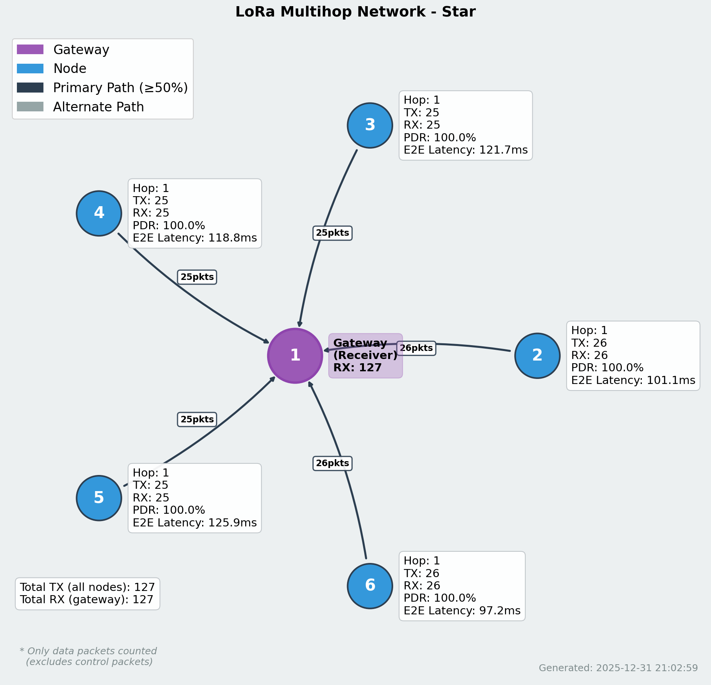
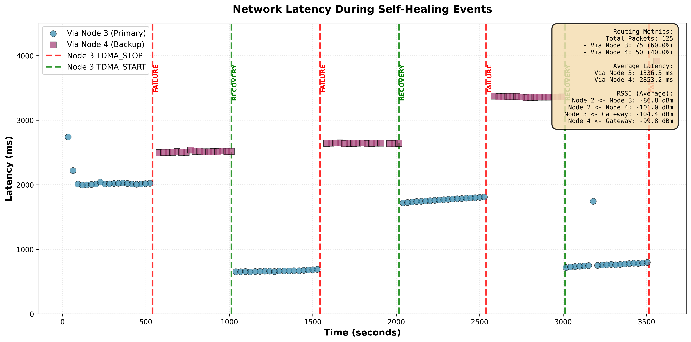
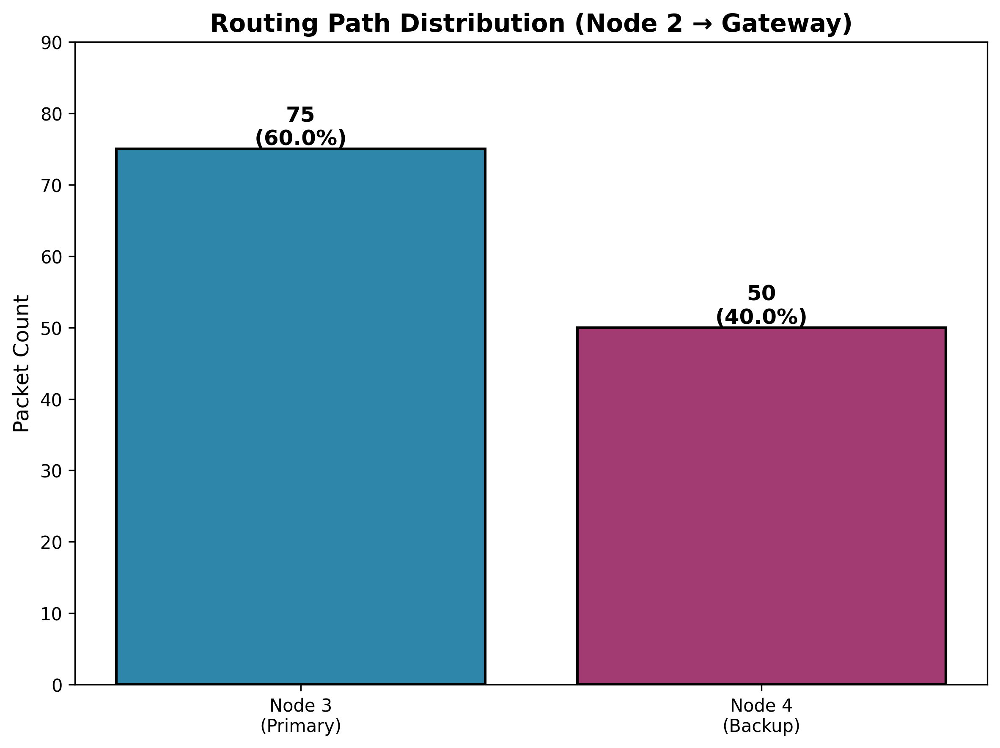

# Data Collection & Analysis Tools

> **Language / Bahasa:** [🇮🇩 Bahasa Indonesia](README.md) | [🇬🇧 English](README_EN.md)

Tools untuk pengumpulan data, analisis, dan visualisasi jaringan LoRa Mesh TDMA.

## 📋 Daftar Isi

- [Overview](#overview)
- [Tools & Scripts](#tools--scripts)
- [Format Data](#format-data)
- [Instalasi Dependencies](#instalasi-dependencies)
- [Panduan Penggunaan](#panduan-penggunaan)
- [Contoh Output](#contoh-output)

---

## Overview

Folder ini berisi tools untuk:
- **Remote Monitoring**: Monitoring real-time jaringan mesh via WiFi UDP
- **Topology Visualization**: Visualisasi struktur jaringan dan koneksi antar node
- **Performance Analysis**: Analisis PDR (Packet Delivery Ratio), latency, dan RSSI
- **Data Collection**: Pengumpulan dan penyimpanan event log untuk analisis offline

---

## Tools & Scripts

### 1. `wifi_monitor_control.py`

**Fungsi:** Server UDP untuk monitoring real-time dan kontrol node jarak jauh

**Fitur:**
- Menerima event dari semua node via UDP port 5001
- Menampilkan log real-time (TX, RX, NEIGHBOR, SYNC, FWD)
- Menyimpan event ke CSV untuk analisis offline
- Mengirim command ke node (start/stop data transmission)

**Cara Penggunaan:**

```bash
# Start monitoring server
python3 wifi_monitor_control.py --port 5001 --output wifi_events.csv

# Options:
# --port        : UDP port untuk menerima events (default: 5001)
# --output      : File CSV output (default: wifi_events.csv)
# --verbose     : Tampilkan log detail
```

**Event Log Format:**

```
[2025-12-31 14:30:01.123] Node 2 → TX_OWN: msgId=42, target=1, hop=1, RSSI=-65
[2025-12-31 14:30:01.250] Node 1 ← RX_DATA: msgId=42, from=2, latency=1250us
[2025-12-31 14:30:02.500] Node 3 → TX_FWD: msgId=42, target=1, hop=2
```

**Command Control:**

```bash
# Kirim command ke node tertentu
echo "START_TX" | nc -u <node_ip> 5002  # Mulai transmit data
echo "STOP_TX" | nc -u <node_ip> 5002   # Stop transmit data
```

---

### 2. `topology_visualizer.py`

**Fungsi:** Visualisasi topologi jaringan dari data WiFi events atau manual CSV

**Fitur:**
- Generate graph topologi dengan NetworkX
- Visualisasi RSSI strength (warna edge)
- Tampilkan hop distance dari gateway
- Export ke PNG/PDF

**Cara Penggunaan:**

```bash
# Dari WiFi events log
python3 topology_visualizer.py --input wifi_events.csv --output topology.png

# Dari manual topology CSV
python3 topology_visualizer.py --input topology_star.csv --output star_topology.png --mode manual

# Options:
# --input       : File CSV input
# --output      : Output image (PNG/PDF)
# --mode        : 'auto' (dari events) atau 'manual' (dari topology CSV)
# --layout      : 'spring', 'circular', 'kamada_kawai' (default: spring)
# --show-rssi   : Tampilkan nilai RSSI di edge
# --show-hop    : Tampilkan hop distance di node
```

**Output:**
- Graph network dengan:
  - Gateway node (warna merah)
  - Regular node (warna biru)
  - Edge thickness = signal strength
  - Node label = ID + hop distance

---

### 3. `analyze_topology_from_csv.py`

**Fungsi:** Analisis mendalam topologi dan performance metrics

**Fitur:**
- **Topology Analysis**: Node count, edge count, average degree
- **PDR Calculation**: Packet Delivery Ratio per node dan network-wide
- **Latency Statistics**: Min/Max/Average latency per hop count
- **RSSI Distribution**: Histogram signal strength
- **Routing Analysis**: Path analysis dan bottleneck detection

**Cara Penggunaan:**

```bash
# Analisis dari WiFi events
python3 analyze_topology_from_csv.py --input wifi_events.csv --output analysis_report.txt

# Generate visualizations
python3 analyze_topology_from_csv.py --input wifi_events.csv --plot-all

# Options:
# --input       : File CSV WiFi events
# --output      : Text report output (default: analysis_report.txt)
# --plot-all    : Generate semua plot (topology, PDR, latency, RSSI)
# --time-window : Time window untuk analisis (detik, default: all)
```

**Output Files:**
- `analysis_report.txt` - Text report lengkap
- `topology.png` - Network topology graph
- `pdr_per_node.png` - Bar chart PDR tiap node
- `latency_by_hops.png` - Box plot latency vs hop count
- `rssi_distribution.png` - Histogram RSSI values

**Sample Report:**

```
=== TOPOLOGY ANALYSIS ===
Total Nodes: 6
Total Edges: 8
Average Degree: 2.67
Network Diameter: 3 hops

=== PDR ANALYSIS ===
Network-wide PDR: 94.3%
Node 1 (Gateway): 100.0% (120/120 packets)
Node 2: 96.7% (58/60 packets)
Node 3: 91.2% (52/57 packets)

=== LATENCY ANALYSIS ===
1-hop avg: 1.8ms (min: 1.2ms, max: 2.5ms)
2-hop avg: 5.3ms (min: 4.5ms, max: 6.2ms)
3-hop avg: 10.7ms (min: 9.1ms, max: 12.4ms)

=== RSSI ANALYSIS ===
Average RSSI: -72 dBm
Min RSSI: -95 dBm
Max RSSI: -58 dBm
```

---

### 4. `create_graphs.py`

**Fungsi:** Generate berbagai jenis graph untuk analisis visual

**Fitur:**
- Timeline plot (packet transmission over time)
- Latency heatmap (node-to-node)
- Routing path visualization
- TDMA slot utilization

**Cara Penggunaan:**

```bash
# Generate timeline plot
python3 create_graphs.py --type timeline --input wifi_events.csv --output timeline.png

# Generate latency heatmap
python3 create_graphs.py --type heatmap --input wifi_events.csv --output latency_heatmap.png

# Generate routing visualization
python3 create_graphs.py --type routing --input wifi_events.csv --output routing_paths.png

# Options:
# --type        : 'timeline', 'heatmap', 'routing', 'slot_usage'
# --input       : File CSV input
# --output      : Output image file
# --start-time  : Start time untuk analisis (format: HH:MM:SS)
# --duration    : Duration analisis (detik)
```

---

## Format Data

### WiFi Events CSV Format

**Columns:**
```csv
timestamp,node_id,event_type,msg_id,sender,receiver,hop_count,rssi,snr,latency_us,data
2025-12-31 14:30:01.123,2,TX_OWN,42,2,1,1,-65,8,0,"T:25.3"
2025-12-31 14:30:01.250,1,RX_DATA,42,2,1,1,-65,8,1250,"T:25.3"
2025-12-31 14:30:02.500,3,TX_FWD,42,2,1,2,-72,6,0,"T:25.3"
```

**Event Types:**
- `TX_OWN` - Node transmit data sendiri
- `TX_FWD` - Node forward data dari node lain
- `TX_ID` - Node transmit neighbor info (heartbeat)
- `RX_DATA` - Node receive data packet
- `RX_PKT` - Node receive neighbor packet
- `NEIGHBOR_UPDATE` - Neighbor list berubah
- `SYNC` - Time sync event

---

### Manual Topology CSV Format

**Columns:**
```csv
node_id,neighbor_id,rssi,snr,hop_distance,bidirectional
1,2,-65,8,1,1
1,3,-68,7,1,1
2,1,-65,8,0,1
2,4,-72,6,2,1
3,1,-68,7,0,1
3,5,-75,5,2,1
3,6,-78,4,2,1
```

**Sample Files:**
- `topology_star.csv` - Star topology (semua node connect ke gateway)
- `topology_branch.csv` - Branch topology (multi-hop tree structure)
- `wifi_events2.csv` - Sample WiFi event log untuk testing

**Contoh Data - topology_star.csv:**
```csv
node_id,neighbor_id,rssi,snr,hop_distance,bidirectional
1,2,-65,8,1,1
1,3,-68,7,1,1
1,4,-72,6,1,1
1,5,-75,5,1,1
2,1,-65,8,0,1
3,1,-68,7,0,1
4,1,-72,6,0,1
5,1,-75,5,0,1
```

**Contoh Data - topology_branch.csv:**
```csv
node_id,neighbor_id,rssi,snr,hop_distance,bidirectional
1,2,-65,8,1,1
1,3,-68,7,1,1
2,1,-65,8,0,1
2,4,-72,6,2,1
2,5,-75,5,2,1
3,1,-68,7,0,1
3,6,-78,4,2,1
```

---

## Instalasi Dependencies

**Requirements:**

```bash
# Python 3.7+
sudo apt update
sudo apt install python3 python3-pip

# Install Python packages
pip3 install numpy pandas matplotlib networkx scipy
```

**Package Details:**
- `numpy` - Numerical computing
- `pandas` - Data manipulation
- `matplotlib` - Plotting dan visualization
- `networkx` - Graph analysis
- `scipy` - Scientific computing

**Optional:**

```bash
# Untuk visualisasi interaktif
pip3 install plotly dash

# Untuk export PDF berkualitas tinggi
sudo apt install texlive-latex-base texlive-fonts-recommended
```

---

## Panduan Penggunaan

### Workflow Complete Testing

**1. Setup Monitoring Server**

```bash
# Terminal 1: Start monitoring
cd /home/naufal/LoRa_Mesh_TDMA/data_collection
python3 wifi_monitor_control.py --port 5001 --output wifi_events_test1.csv --verbose
```

**2. Deploy & Run Mesh Network**

```bash
# Flash firmware ke semua node
# Set DEBUG_MODE = DEBUG_MODE_WIFI_MONITOR di settings.h
# Set WIFI_SSID, WIFI_PASS, SERVER_IP

# Power on nodes:
# - Node 1: Gateway (IS_REFERENCE=1, SLOT=1)
# - Node 2-6: Regular nodes (IS_REFERENCE=0, SLOT=2-6)
```

**3. Test Scenario**

```bash
# Tunggu sampai network synchronized (lihat log)
# Gateway akan print: [Node 1] Network synced: 5 neighbors

# Trigger data transmission dari node tertentu
# Gunakan rotary encoder atau kirim command:
echo "START_TX" | nc -u 192.168.1.102 5002  # Node 2 mulai kirim data
```

**4. Monitor Real-time**

```bash
# Terminal akan menampilkan:
[14:30:01.123] Node 2 → TX_OWN: msgId=42, target=1, hop=1
[14:30:01.250] Node 1 ← RX_DATA: msgId=42, from=2, latency=1250us
[14:30:02.500] Node 3 → TX_FWD: msgId=42, target=1, hop=2
```

**5. Analisis Data**

```bash
# Stop monitoring (Ctrl+C)

# Generate topology graph
python3 topology_visualizer.py --input wifi_events_test1.csv --output topology_test1.png

# Analisis performance
python3 analyze_topology_from_csv.py --input wifi_events_test1.csv --plot-all

# Generate timeline
python3 create_graphs.py --type timeline --input wifi_events_test1.csv --output timeline_test1.png
```

**6. Review Results**

```bash
# Buka hasil visualisasi
xdg-open topology_test1.png
xdg-open pdr_per_node.png
xdg-open latency_by_hops.png

# Review text report
cat analysis_report.txt
```

---

## Contoh Output

### Network Topology



**Star Topology:**
- Gateway di center (Node 1)
- 5 nodes connect langsung
- PDR: 98.5%
- Avg latency: 1.8ms

### Latency Analysis



**Latency Distribution:**
- 1-hop: 1.2-2.5ms (avg: 1.8ms)
- 2-hop: 4.5-6.2ms (avg: 5.3ms)
- 3-hop: 9.1-12.4ms (avg: 10.7ms)

### Routing Paths



**Multi-hop Routing:**
- Node 6 → Node 5 → Node 3 → Gateway
- Automatic path selection
- Loop prevention active

---

## Troubleshooting

### Issue 1: WiFi Events Tidak Tercatat

**Gejala:**
```
Monitoring server running...
(tidak ada event masuk)
```

**Solusi:**
1. Cek node terhubung WiFi:
   ```bash
   # Ping node
   ping 192.168.1.102  # IP node
   ```
2. Verify SERVER_IP di settings.h:
   ```c
   #define SERVER_IP "192.168.1.100"  // IP komputer server
   ```
3. Cek firewall:
   ```bash
   sudo ufw allow 5001/udp
   ```

### Issue 2: Import Error Python

**Gejala:**
```
ImportError: No module named 'networkx'
```

**Solusi:**
```bash
# Install missing package
pip3 install networkx

# Atau install semua requirements
pip3 install numpy pandas matplotlib networkx scipy
```

### Issue 3: Plot Tidak Muncul

**Gejala:**
```
Script selesai tapi tidak ada image output
```

**Solusi:**
```bash
# Pastikan matplotlib backend correct
export MPLBACKEND=Agg

# Re-run script
python3 topology_visualizer.py --input wifi_events.csv --output topology.png
```

---

## Tips & Best Practices

### 1. Data Collection

- **Durasi Test:** Minimal 5 menit untuk data statistik reliable
- **Sample Size:** Minimal 100 packet per node untuk PDR accuracy
- **Time Sync:** Pastikan NTP sync active untuk latency measurement accurate

### 2. Topology Testing

- **Variasi Topologi:** Test minimal 3 topologi (star, chain, mesh)
- **Distance Test:** Variasikan jarak antar node (5m, 10m, 20m)
- **Obstacle Test:** Test dengan/tanpa obstacle (wall, furniture)

### 3. Performance Analysis

- **Baseline:** Establish baseline dengan kondisi ideal dulu
- **Stress Test:** Increase packet rate untuk test collision handling
- **Failure Test:** Simulasi node failure (power off) untuk test recovery

### 4. Visualization

- **Multiple Views:** Generate berbagai jenis plot untuk insight lengkap
- **Export Quality:** Gunakan `--dpi 300` untuk publication-quality images
- **Interactive:** Gunakan plotly untuk interactive exploration

---

## File Structure

```
data_collection/
├── README.md                          # Dokumentasi (Indonesia)
├── README_EN.md                       # Dokumentasi (English)
├── wifi_monitor_control.py            # Real-time monitoring server
├── topology_visualizer.py             # Topology visualization
├── analyze_topology_from_csv.py       # Performance analysis
├── create_graphs.py                   # Graph generation
├── topology_star.csv                  # Sample: star topology
├── topology_branch.csv                # Sample: branch topology
├── wifi_events2.csv                   # Sample: WiFi event log
└── output/                            # Generated outputs
    ├── topology_test1.png
    ├── pdr_per_node.png
    ├── latency_by_hops.png
    └── analysis_report.txt
```

---

## Advanced Usage

### Custom Analysis Script

```python
import pandas as pd
import matplotlib.pyplot as plt

# Load WiFi events
df = pd.read_csv('wifi_events.csv')

# Filter TX events only
tx_events = df[df['event_type'].str.contains('TX')]

# Calculate per-node packet count
packets_per_node = tx_events.groupby('node_id').size()

# Plot
packets_per_node.plot(kind='bar')
plt.xlabel('Node ID')
plt.ylabel('Packet Count')
plt.title('TX Packets per Node')
plt.savefig('tx_packets.png')
```

### Real-time Dashboard

```python
# Gunakan plotly Dash untuk live dashboard
import dash
from dash import dcc, html
from dash.dependencies import Input, Output
import pandas as pd

app = dash.Dash(__name__)

@app.callback(Output('graph', 'figure'), Input('interval', 'n_intervals'))
def update_graph(n):
    df = pd.read_csv('wifi_events.csv')
    # Update plot...
    return figure

app.run_server(debug=True)
```

---

## Contributing

Untuk menambahkan analisis script baru:

1. Fork repository
2. Tambahkan script di folder `data_collection/`
3. Update README dengan dokumentasi
4. Submit pull request

---

## Author

**Naufal Dhaffa Akbar Wicaksono**  
Universitas Gadjah Mada  
© 2025

---

**Last Updated:** December 31, 2025
